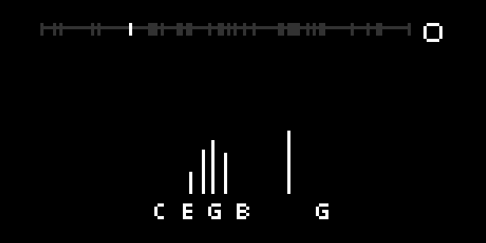

# midiviz

Simple visualisation, recording and playback for the monome norns
of what you're currently playing on your MIDI device.

I find this useful when I'm practising digital piano and want to review
what I've done - for example, where I hit a wrong note, or if I'm
playing all the notes in a chord relatively evenly.

MIDI notes are displayed as note names and vertical bars.
Recording captures both the MIDI notes and the audio.
Then you can scroll back to see those notes, and replay what
you've recorded.

- k2 = play/stop
- k2 long press = record
- e2 = scroll through time



## Running the tests

There aren't enough tests.

```
cd lib
lua test_all.lua
```
