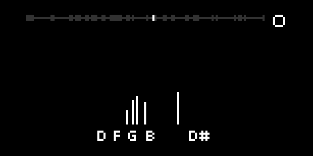

# midi review

Simple visualisation, recording and playback for the monome norns
of what you've just been playing on your MIDI device.



I find this useful when I'm practising digital piano and want to review
what I've done - for example,
if I want to see which wrong note I hit,
or how (un)evenly I'm playing all the notes in a chord.

MIDI notes are displayed as note names and vertical bars.
Recording captures both the MIDI notes and the audio.
Then you can scroll back to see those notes, and replay what
you've recorded. Non-note MIDI data is not captured or visualised.

- k2 = play/stop
- k2 long press = record
- e2 = scroll through time
- e3 = change size of recording window

When you start recording, notes and audio are recorded into a rolling
window. For example, if the rolling window is 10 seconds then (only)
the last 10 seconds will be retained. If you change the size of the
rolling window then that change will only come into effect when
you next start recording.

## Running the tests

```
cd lib
lua test_all.lua
```
